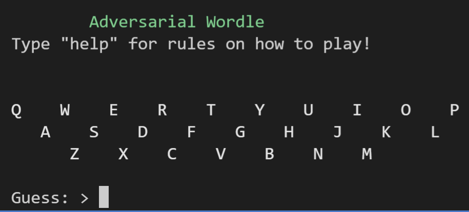
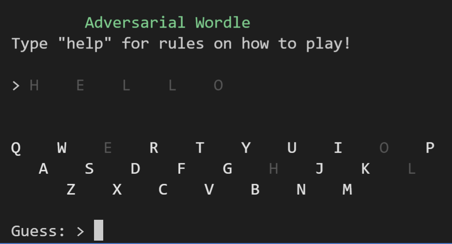
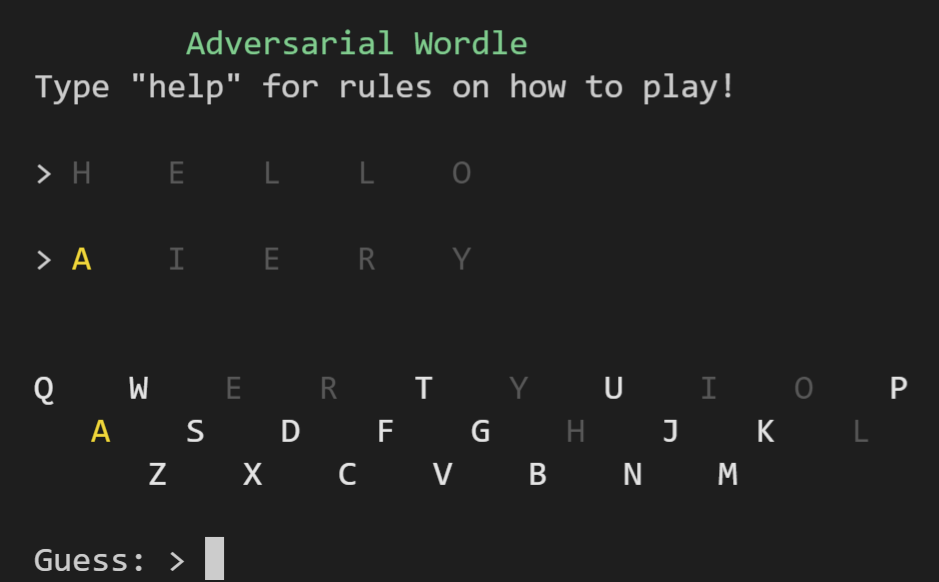
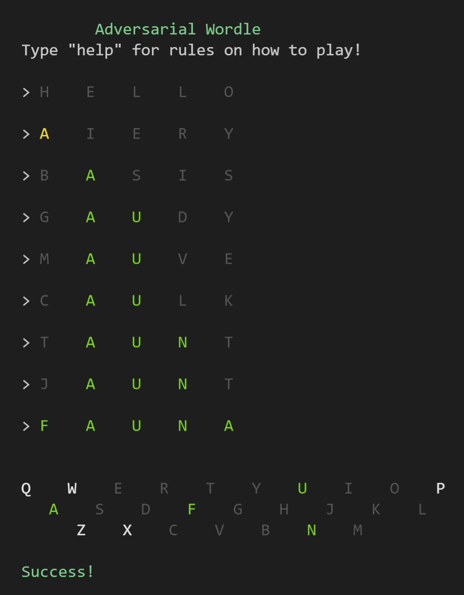
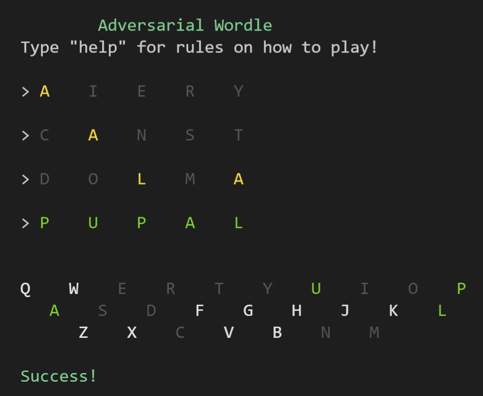
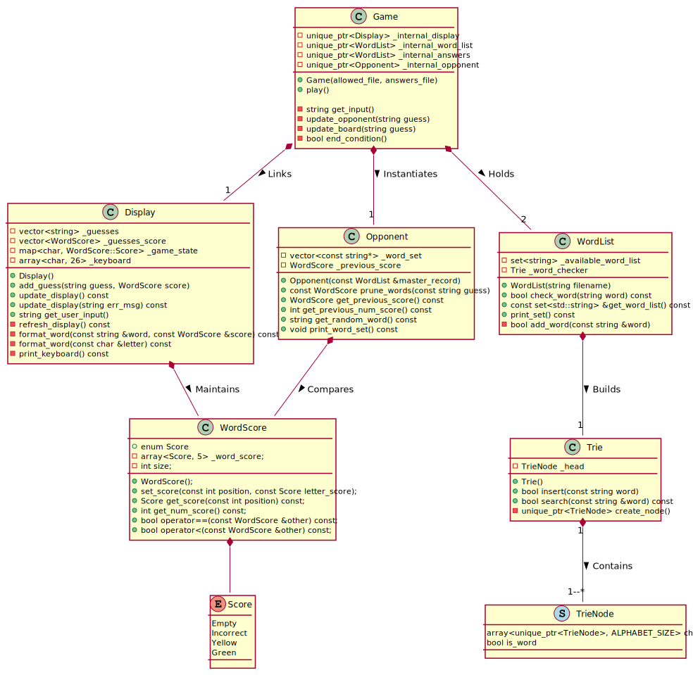

# Adversarial Wordle

## Building and Install
This project requires Cmake >= v3.16 to build.
~~~
mkdir build
cd build
~~~

If using MS Visual Studio compiler, to build the Release version use:
~~~
cmake ..
cmake --build . --config Release
~~~

If using Unix Makefiles, ensure it is set to Release:
~~~
cmake -DCMAKE_BUILD_TYPE=Release ..
cmake --build .
~~~

Only standard library (STL) packages are used. These are listed in dOxygen documents found in the `diagrams` folder.

## Adversarial Wordle
Adversarial Wordle is a game inspired by [Wordle](https://www.nytimes.com/games/wordle/index.html), a popular five letter word guessing game. This spin on Wordle was originally created by `qntm` in their game [Absurdle](https://qntm.org/files/absurdle/absurdle.html), where technical insight was gleaned from `qntm`'s insightful [blog post](https://qntm.org/absurdle).

Adversarial Wordle is an adversarial (as the name implies) version of Wordle. The player inputs guesses of five letter words and the computer aims to give the player the least useful information as possible.

In contrast to Wordle, this program does not pick a single hidden word. It instead maintains a list of words that conform to the player's guesses. The program aims to prune this list as little as possible on each guess.

Type `help` for more information and how to play, including meaning of colours.

### An Example:

### The Optimal Solution:

This game is completely deterministic, where the randomness of the solution is entirely dependent of the randomness of the player input. You can verify these examples by following the guesses exactly in order.

The optimal strategy here is to choose words that eliminate as many letters as possible, as quickly as possible. The player needs to narrow the program down to one word quickly.

## Class Structure

The class structure is as shown:

## Addressed Rubric Conditions for Udacity C++ Nanodegree Capstone Project

1. The project reads data from a file and process the data, or the program writes data to a file: See [file_reader.ccp, 30](src/file_reader.cpp#L30).
2. The project accepts user input and processes the input: See [game_loop.ccp, 73](src/game_loop.cpp#L73) and [display.cpp, 151](src/display.cpp#L151).
3. The project demonstrates an understanding of C++ functions and control structures. See code in `src` and class structure above.
4. Overloaded functions allow the same function to operate on different parameters. See [display.cpp, 130-139](src/display.cpp#L130) and [word_score.cpp, 32-47](src/word_score.cpp#L32) for overloaded operators.
5. The project uses Object Oriented Programming techniques. See code in `include`.
6. Classes encapsulate behavior. See [opponent.h](include/opponent.h) as an example.
7. The project makes use of references in function declarations. See [opponent.cpp, 7](src/opponent.cpp#L7) as an example of use of references.
8. The project uses scope / Resource Acquisition Is Initialization (RAII) where appropriate. All data structures are declared using `unique_ptr` or are managed by a class. See [game_loop.h](include/game_loop.h). An exception to this occurs in the constructor of the `Opponent` class (see [opponent.cpp, 7](src/opponent.cpp#L7)), where a a vector of pointers to an outside object is managed. This was done to reduce copying a large dataset. The scope of `Opponent` is then managed by `Game`. 